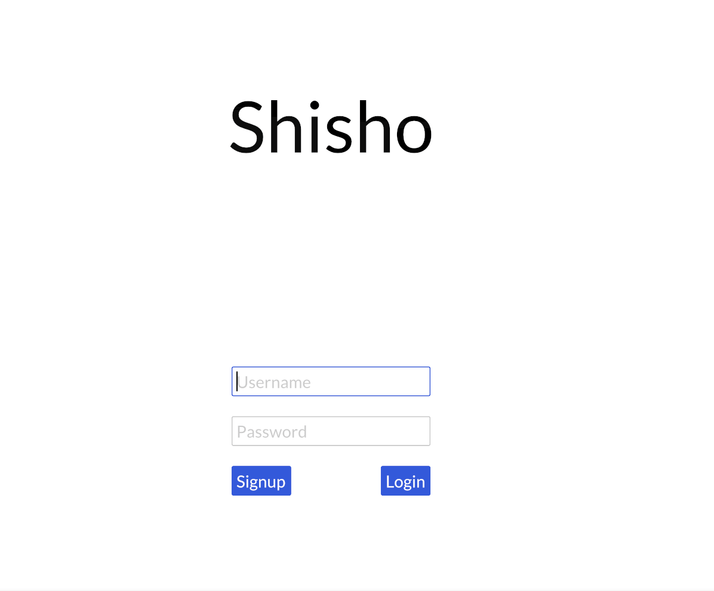

# Shisho

Shisho (Japanese for librarian) is a flashcard-based learning app influenced by the [spaced-repetition](https://en.wikipedia.org/wiki/Spaced_repetition)  methodology.

Shisho is written in Rust using [Iced](https://github.com/iced-rs/iced). It depends on [Toshokan](https://github.com/XaviFP/toshokan) as its backend.

## How to run 

Install [Rust](https://www.rust-lang.org/tools/install) and run:

```
$ cargo run
```

Make sure to have [Toshokan](https://github.com/XaviFP/toshokan) running.

## Preview


